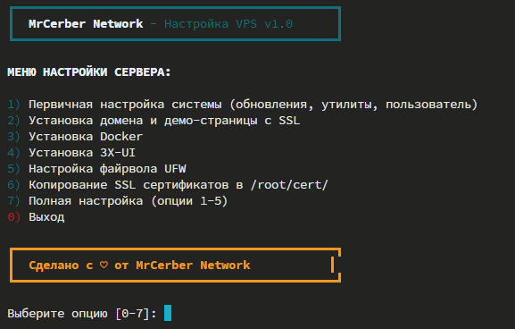

# 🚀 MrCerber Network - VPS Setup Script


Мощный Bash-скрипт для быстрой и эффективной настройки Ubuntu VPS серверов с русскоязычным интерфейсом.

## ✨ Основные возможности

- 🛠️ **Первичная настройка системы** - обновления, утилиты, создание пользователя, SWAP
- 🔐 **Настройка домена с SSL** - проверка DNS, оптимизированный Nginx с автоматическим SSL и демо-страницей на Tailwind CSS
- 🐳 **Установка Docker** - установка по официальной инструкции
- 🌐 **Установка 3X-UI** - панель управления для прокси-сервисов с автокопированием SSL
- 🔥 **Настройка Firewall (UFW)** - настройка безопасности сервера
- 📜 **Управление SSL сертификатами** - копирование и организация сертификатов для приложений

## 🚀 Быстрая установка

```bash
bash <(curl -Ls https://raw.githubusercontent.com/MrCerber/Network/main/install.sh)
```

## 📋 Опции меню

1. **Первичная настройка системы** - обновления, базовые утилиты, создание пользователя
2. **Настройка домена и демо-страницы** - включая автоматический SSL с проверкой DNS
3. **Установка Docker**
4. **Установка 3X-UI** - с возможностью копирования SSL сертификатов
5. **Настройка файрвола UFW**
6. **Копирование SSL сертификатов** - в /root/cert/ для использования в приложениях
7. **Полная настройка** - все основные опции (1-5) за один раз

## 🔧 Системные требования

- Ubuntu сервер (рекомендуется 20.04 LTS или новее)
- Root-доступ
- Интернет-соединение
- **Для настройки домена**: правильно настроенные DNS записи

## 🌐 Требования для настройки домена

Перед настройкой домена убедитесь, что у вас настроены DNS записи:

```
Тип: A
Имя: yourdomain.com (или @)
Значение: IP_ВАШЕГО_СЕРВЕРА

Тип: A
Имя: www
Значение: IP_ВАШЕГО_СЕРВЕРА
```

Скрипт автоматически проверит DNS конфигурацию перед началом настройки SSL.

## 📸 Скриншот интерфейса



## 🔍 Подробное описание функций

### 1. Первичная настройка системы

- Обновление системных пакетов
- Установка базовых инструментов
- Настройка автоматических обновлений
- Создание нового пользователя с sudo-правами
- Настройка SSH и безопасного доступа
- Настройка SWAP-файла

### 2. Настройка домена с SSL

- **Проверка DNS конфигурации** - автоматическая проверка A-записей домена
- Установка Nginx с оптимальной конфигурацией
- Создание стильной демо-страницы с Tailwind CSS
- Поэтапная настройка SSL (HTTP → получение сертификата → HTTPS)
- Автоматическая настройка SSL через Let's Encrypt
- Расширенные настройки безопасности SSL
- Поддержка HTTP/2 и Gzip-сжатия
- Автоматическое обновление сертификатов через cron

### 3. Установка Docker

- Установка Docker и Docker Compose по официальной инструкции
- Настройка прав пользователя для работы с Docker
- Запуск тестового контейнера для проверки

### 4. Установка 3X-UI

- **Опциональное копирование SSL сертификатов** в /root/cert/ перед установкой
- Установка панели управления 3X-UI
- Инструкции по настройке SSL в панели
- Готовые пути к сертификатам для быстрой настройки

### 5. Настройка файрвола

- Базовая защита сервера через UFW
- Автоматическое открытие портов SSH, HTTP, HTTPS
- Интерактивное добавление пользовательских портов
- Поддержка TCP, UDP и комбинированных правил

### 6. Копирование SSL сертификатов

- **Автоматическое копирование** всех SSL сертификатов из /etc/letsencrypt/live/
- Организация по папкам доменов в /root/cert/
- Правильные права доступа для безопасности
- Готовые пути для использования в приложениях

## 📝 Примечания

- Скрипт требует root-прав для работы
- Интерфейс скрипта на русском языке
- Рекомендуется делать резервные копии перед использованием на рабочем сервере
- **DNS проверка**: скрипт автоматически проверяет правильность настройки DNS перед созданием SSL
- **SSL сертификаты**: автоматически копируются в /root/cert/ для удобного использования в приложениях
- **Поэтапная настройка SSL**: исключает ошибки порочного круга при настройке HTTPS

## 🔄 Новые возможности v1.0

- ✅ **Автоматическая проверка DNS** перед настройкой SSL
- ✅ **Поэтапная настройка SSL** (HTTP → SSL сертификат → HTTPS)
- ✅ **Копирование SSL сертификатов** в удобную директорию /root/cert/
- ✅ **Интеграция с 3X-UI** - автоматическое предложение копирования SSL
- ✅ **Расширенная обработка ошибок** с понятными инструкциями
- ✅ **Улучшенная структура меню** с дополнительными опциями

## 📜 Лицензия

[MIT License](LICENSE)

## 👨‍💻 Разработчик

[MrCerber](https://github.com/MrCerber)
