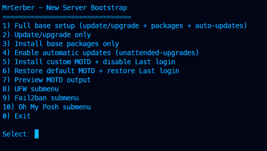
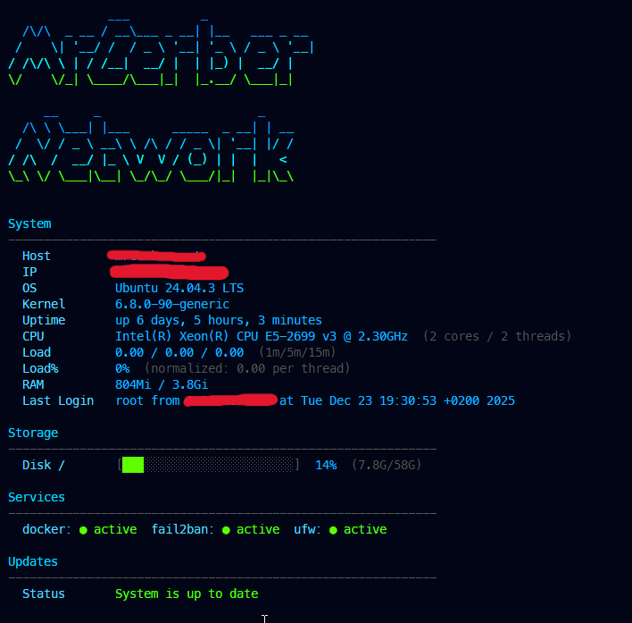

# MrCerber Network V2 — Bootstrap для сервера


Интерактивный bash‑скрипт для первичной настройки Ubuntu/Debian серверов. Запускается от root и дает меню для базовой настройки, безопасности и MOTD.

## Возможности

- интерактивное меню + подменю (UFW / Fail2ban / Oh My Posh)
- установка базовых пакетов
- автоматические обновления (unattended‑upgrades)
- кастомный MOTD и отключение "Last login"
- восстановление дефолтного MOTD и "Last login"

## Быстрый запуск (удаленно)

```bash
sudo bash <(curl -Ls https://raw.githubusercontent.com/MrCerber/Network/refs/heads/main/v2/install.sh)
```

## Запуск локально

```bash
chmod +x v2/install.sh
sudo ./v2/install.sh
```

## Структура V2

- `install.sh` — основной скрипт
- `99-mrcerber` — скрипт MOTD
- `logo.txt` — ASCII‑логотип

## Меню

1. Full base setup (update/upgrade + packages + auto‑updates)
2. Update/upgrade only
3. Install base packages only
4. Enable automatic updates (unattended‑upgrades)
5. Install custom MOTD + disable Last login
6. Restore default MOTD + restore Last login
7. Preview MOTD output
8. UFW submenu
9. Fail2ban submenu
10. Oh My Posh submenu

## Кастомный MOTD

Скрипт ожидает рядом с `install.sh`:

- `99-mrcerber`
- `logo.txt`

При запуске через `curl` файлы скачиваются автоматически из:

```
https://raw.githubusercontent.com/MrCerber/Network/refs/heads/main/v2
```

Можно переопределить источник:

```bash
MOTD_BASE_URL="https://example.com/path" sudo bash <(curl -Ls https://raw.githubusercontent.com/MrCerber/Network/refs/heads/main/v2/install.sh)
```

Резервные копии сохраняются в:

```
/root/.mrcerber-bootstrap-backups
```

## Как изменить логотип

Где хранится логотип:

- локально: `v2/logo.txt`
- на сервере: `/etc/update-motd.d/logo.txt`

Как изменить:

1. Сгенерируй ASCII‑логотип на сайте:  
   https://patorjk.com/software/taag/
2. Сохрани результат в `v2/logo.txt`.
3. Запусти пункт меню **5) Install custom MOTD** (или замени файл на сервере вручную).

Подсказка: если логотип слишком широкий, он будет ломать выравнивание. Держи ширину около 60 символов.

## Изменяемые файлы

- `/etc/apt/apt.conf.d/20auto-upgrades`
- `/etc/apt/apt.conf.d/50unattended-upgrades`
- `/etc/update-motd.d/*`
- `/etc/ssh/sshd_config` (PrintLastLog)
- `/etc/fail2ban/jail.local` (опционально)
- `/root/.bashrc` (интеграция Oh My Posh)

## Устанавливаемые пакеты

- ca-certificates, curl, wget, gnupg, lsb-release
- unzip, zip, tar
- nano, vim
- htop, btop
- net-tools, iproute2
- dnsutils
- jq
- git
- ufw
- fail2ban
- unattended-upgrades
- apt-listchanges
- openssh-server

## Примечания

- Запускать строго от root.
- Скрипт не создает пользователей, не меняет часовой пояс и swap.
- После включения Oh My Posh нужен релогин.

## Скриншоты





## Лицензия

[MIT License](../LICENSE)
